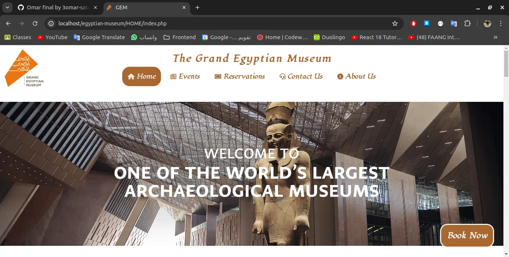

# 🏛️ Grand Egyptian Museum (GEM) Website




## 📌 Project Overview

This website is developed for the Grand Egyptian Museum to provide an interactive and informative experience for visitors.

Users can:

Browse the museum website and explore its content

View daily events and museum activities

Book tickets online without logging in

Contact the museum administration via email

Administrators can:

Add and manage events, images, and videos

Respond to user messages via email

View and print monthly reports including:

Ticket reservations

Added events and articles

Messages received from users

## The system is designed to be user-friendly, responsive, and efficient for both visitors and administrators.

## 🧰 Technologies Used

- **Frontend**

  - HTML5
  - CSS3
  - Bootstrap
  - JavaScript

- **Backend**

  - PHP (Procedural)
  - MySQL

- **Other**
  - Font Awesome
  - Google Fonts

---

## 🗄️ Database Structure

Main tables used in the project:

- `user`
- `admin`
- `reservations`
- `contact_us`
- `event`
- `phone`
- `visitors`

---

## 🚀 Installation & Setup

1. Clone the repository:
   ```bash
   git clone https://github.com/omar-sala/egyptian-museum.git
   ```
